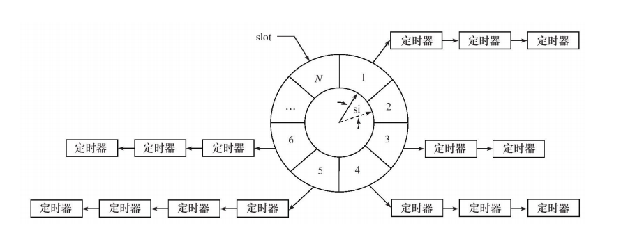

## 定时器相关知识
### 定时器基本概念
定时器通常至少包含两个成员：一个超时时间（相对时间或者绝对时间）和一个任务函数。一般在网络编程中还会包含一个用户信息的数据结构体指针，用于当超时事件发生后对用户相关数据进行处理。

### 基于升序链表定时器
#### 基本概念
本质上是一个按照设定的超时事件排列的升序双向链表。链表中的每一个结点都是一个定时器。
#### 相关操作
- 初始化一个定时器升序链表 
- 添加一个定时器
  - 按照升序顺序查找插入的位置
  - 时间复杂度：$O(n)$
- 删除一个定时器（已知该定时器地址）
  - 时间复杂度：$O(1)$
- 调整一个定时器位置
- tick 心跳函数，用于被 SIGALRM 信号处理函数调用以处理链表上的到期任务
  - 时间复杂度 $O(1)$

#### 特点
- 实现简单但是添加定时器的效率低下
### 简单的时间轮定时器
#### 基本概念
本质上是一个通过拉链来解决哈希冲突的哈希表。

图例：

如图所示，（实线）指针指向轮子上的一个槽（slot）。它以恒定的速度顺时针转动，每转动一下就指向下一个槽（虚线指针指向的槽），每次转动称为一个滴答（tick）。一个滴答的时间称为一个时间轮的槽间隔si（slot interval）,它实际上就是心跳时间。该事件轮共有 N 个槽，因此它运转一周的时间是N * si.每个槽指向一条定时器链表，每条链表上的定时器具有相同的特征：它们的定时时间相差 N * si 的整数倍。时间轮正是利用这个关系将定时器散列到不同的链表中。假如现在指针指向槽cs，我们要添加一个定时时间为 ti 的定时器，则该定时器将被插入槽ts（timer lsot）对应的链表中:

$ ts = (cs + ((ti / si) \%N) ) \%N $

#### 相关操作
- 添加一个定时器
   - 添加的位置： $ ts = (cs + ((ti / si) \%N) ) \ %N $
   - 在该位置中采用头插法，将定时器插入链表
   - 时间复杂度：$ O(1) $
- 删除目标定时器
  - 时间复杂度：$ O(1) $
- tick 心跳函数,执行一个定时器
  - 时间复杂度：O(n)

实际上指定一个定时器的效率要比 $O(n)$好的多，因为时间轮将所有的定时器散列到了不同的链表上。时间轮的槽越多，等价于散列表的入口越多，从而每条链表上的定时器数量越少

此外，可以使用多个轮子来实现时间轮，这时，执行一个定时器任务的时间复杂度是接近$O(1)$的

#### 与基于排序链表的定时器的区别
- 基于排序链表的定时器只有一条来管理所有的定时器，所以插入操作的效率随着定时器数目的增多而降低。
- 时间轮定时器使用哈希表思想，将定时器散列到不同的链表上。这样每条链表上的定时器数量明显少于原来的排序链表上的定时器数目，插入操作的效率基本不受定时器数目的影响

**关键点**

如果要提高定时精度，就要使 si 值足够小；要提高执行效率就要求N值足够大

#### 提高
-  复杂时间轮

### 堆计时器